# موقف العاملين

<!-- ## المقدمة
يهدف النظيم الي تصنيف العاملين بالبنك حسب توجيهات مجلس الإدارة الي عدد من الفئات متفق عليها ، واسنخراج التقارير المناسبة.

####مزايا النظيم
* ادخال وحفظ موقف الموظف حسب التصنيف. 
* التصديق على الحالة المدخلة للموظف بصوره فردية او بصورة جماعية. 
* استرجاع أي بيانات عن موقف الموظف بصورة تاريخية. 
* استخراج التقارير المطلوبة بصورة سريعة.
* إدارة صلاحيات المستخدمين.

####وصف النظام
يوجد في النظام عدد من الصلاحيات  ( مدخل البيانات(Maker) –   مصدق(Checker) - مستعرض (Viewer)).

 * يكمن دور مدخل البيانات بإدخال او تعديل او حذف موقف الموظف قبل التصديق. او ادخال موقف جديد للموظف.
 * بينما يقوم المصدق بقبول او رفض الموقف المدخل للموظف بصوره فردية وهنا نعني كل موظف على حده او للتسهيل يمكن التصديق على عدد من الموظفين بخطوة واحدة.  
* عند تعديل موقف الموظف المصدق مسبقا يقوم النظام بحفظ الحالة السابقة للموظف وتاريخ انتهاء الموقف السابق
 وإدخال الموقف الجديد للموظف وذلك لعمل مرجعية تاريخية عن الموظفين.
* كما يمكن للمستعرض  عرض جميع تقارير موقف الموظفين . -->

##تشغيل النظام
النظام عباره عن موقع إلكتروني يتم الوصول إليه عن طريق الرابط :

<a href="https://172.16.1.155:9877/"  target="_blank" rel="noopener"> https://172.16.1.155:9877 </a>

##دليل الإستخدام
طريقة أستخدام النظيم كالاتي :

<b>يحتوي النظام على عدد من الصلاحيات وكل صلاحية لها أدوار معينه و شاشات معينة </b>
### 1- شاشة تسجيل الدخول للنظام

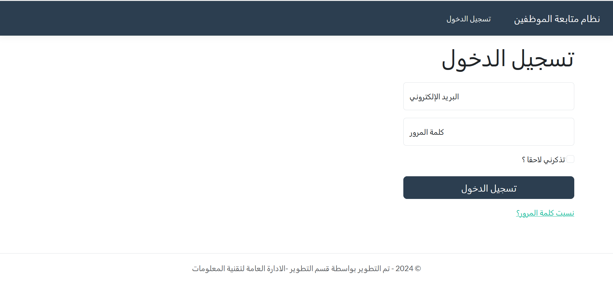

# مدخل البيانات (Maker)
تكمن صلاحية مدخل البيانات بإدخال او تعديل او حذف موقف الموظف قبل التصديق او ادخال موقف جديد للموظف.
### 2- الشاشة الرئيسية لمدخل البيانات 
 
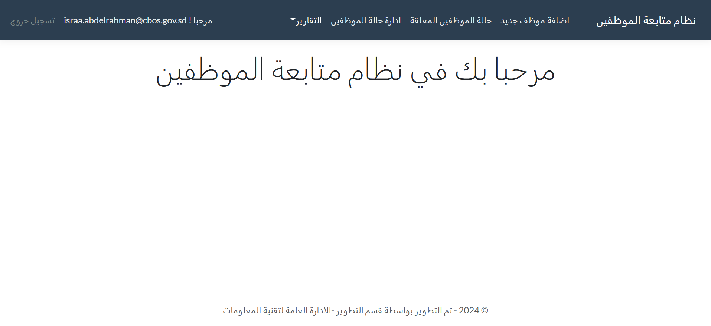

### 3- شاشة إضافة موقف جديد لموظف 

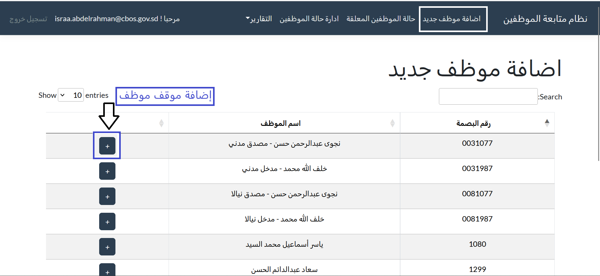

* <b> عند الضغط على زر إضافة موظف يظهر فورم يحتوي على تفاصيل الموظف ليتم إضافة حالته و هذه الإضافه تتم لموظف جديد لم تكن له حاله مسبقه
</b>

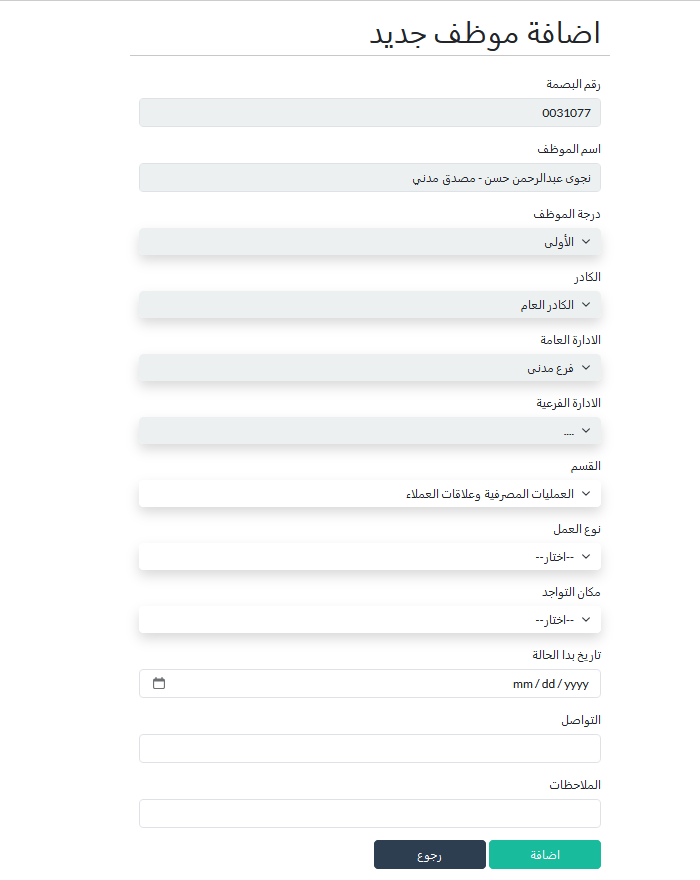

### 4-شاشة الحالات المعلقة
<b> يوجد في هذه الشاشة حالات الموظفين التى لم يتم تصرحيها بعد و يمكن عرض او تعديل او حذف هذه الحاله قبل التصريح</b>

* <b> عند الضغط على زر العرض يظهر فورم يحتوي على تفاصيل الموظف و من خلال هذه الشاشه يمكن الذهاب الى شاشة التعديل او الحذف</b>

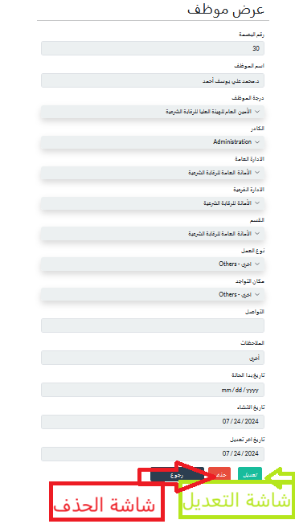

* <b> عند الضغط على زر التعديل يظهر فورم لتعديل موقف الموظف اذا كان التعديل على بيانات الموظف الأساسيه لا يحتاج الى تصريح لكن اذا تم تعديل موقف عمل الموظف لا ينعكس التعديل الا بعد التصريح</b>

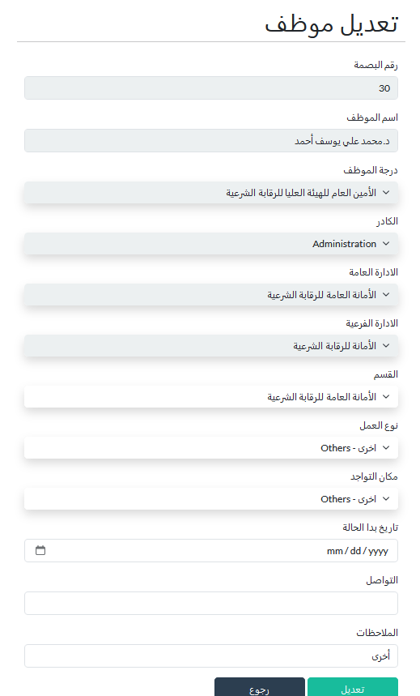

* <b>عند الضغط على زر الحذف يظهر فورم به بيانات الموظف نقوم بإختيار سبب حذف الموظف و تاريخ الحذف

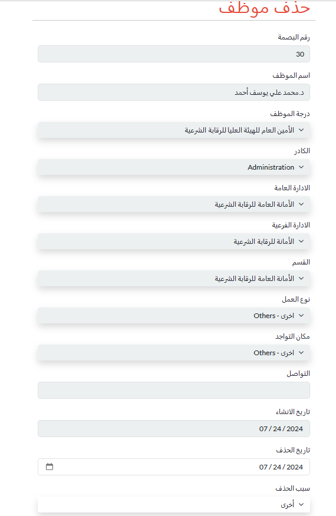

### 5- شاشة إدارة حالة الموظفين
<b>هذه الشاشه تحتوى على كل الموظفين الذين تم إضافة مواقفهم و حالاتهم و يمكن من خلالها عرض بيانات الموظف  او  تعديله او حذفه , و هذا الموظف تم تصديقه مسبقا</b>

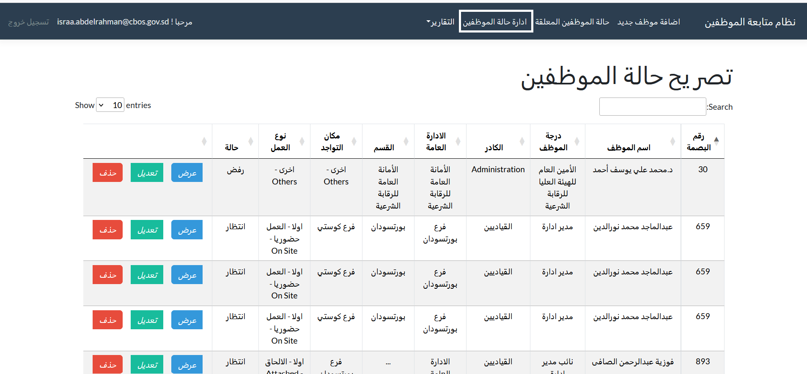

# المصدق (Checker)
 يقوم المصدق بقبول او رفض الموقف المدخل للموظف بصوره فردية وهنا نعني كل موظف على حده او للتسهيل يمكن التصديق على عدد من الموظفين بخطوة واحدة.

### 6-الشاشة الرئيسية للمصدق

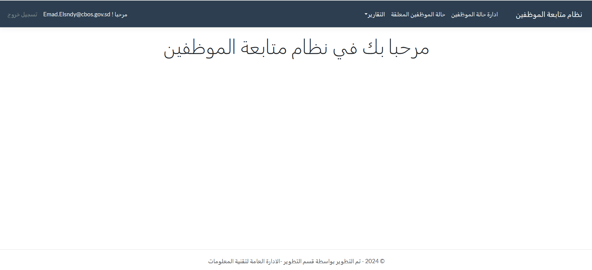

### 7- شاشة إدارة حالة الموظفين
الشاشه تحتوى على كل الموظفين الذين تم إضافة مواقفهم و حالاتهم و من خلالها يتمكن من عرض بيانات كل موظف

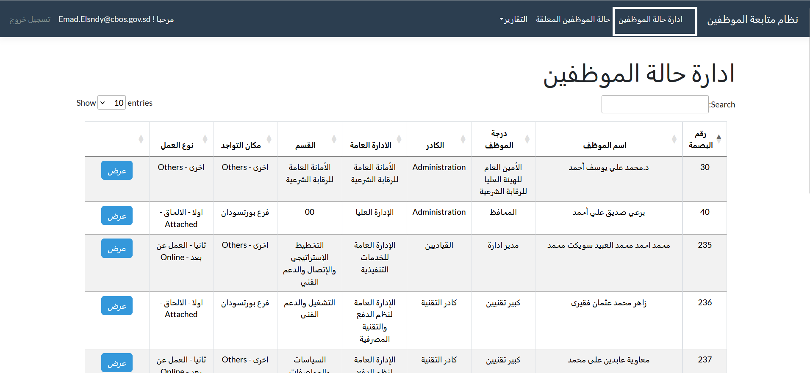

### 8- شاشة الحالات المعلقة

 يوجد في هذه الشاشة حالات الموظفين التى لم يتم تصرحيها بعد و من خلال هذه الشاشه يقوم المصدق برفض حالة موظف( و عند رفض حالة الموظف تعود لمدخل البيانات بحالة رفض و يمكن ان يقوم بتعديلها مره أخرى أو حذفها )او تصريح حالة موظف او تصريح كل الحالات المعلقة

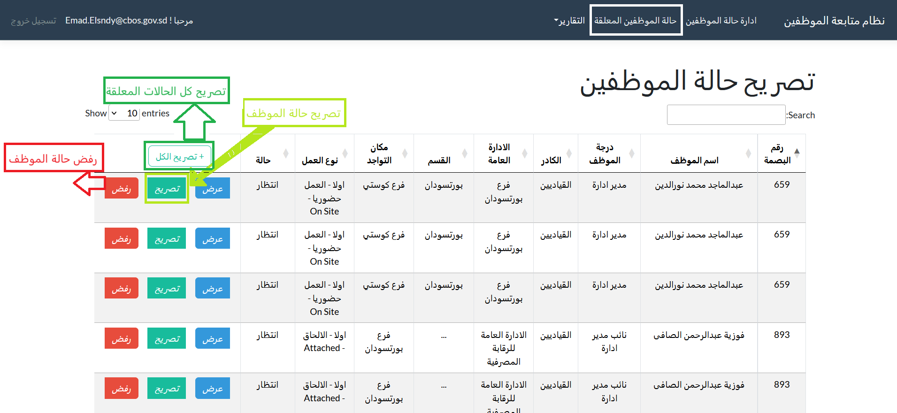

# المستعرض (Viewer)
يمكن للمستعرض عرض جميع تقارير موقف الموظفين .

### 9- الشاشة الرئيسيه للمستعرض

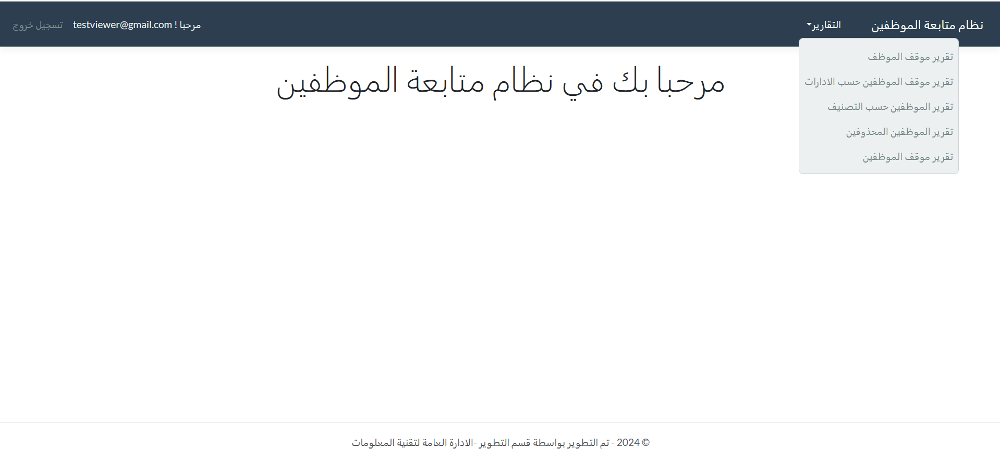

# التقارير

و هذه التقارير تظهر لكل الصلاحيات الموجودة في النظام 

### 10-  تقرير موقف الموظف

هذا التقرير يستخدم للبحث عن موظف بعينه عن طريق بصمة الموظف و يظهر هذا التقرير  الحالة السابقة للموظف وتاريخ بداية الفترة و الموقف الجديد للموظف

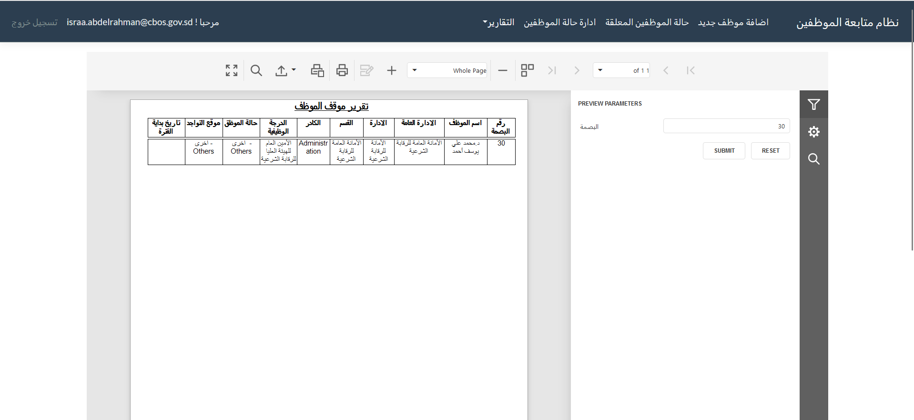

### 11- تقرير موقف الموظفين حسب الإدارات

هذا التقرير يحتوي على الفترة و الإدارة و الإدارة الفرعية و القسم 

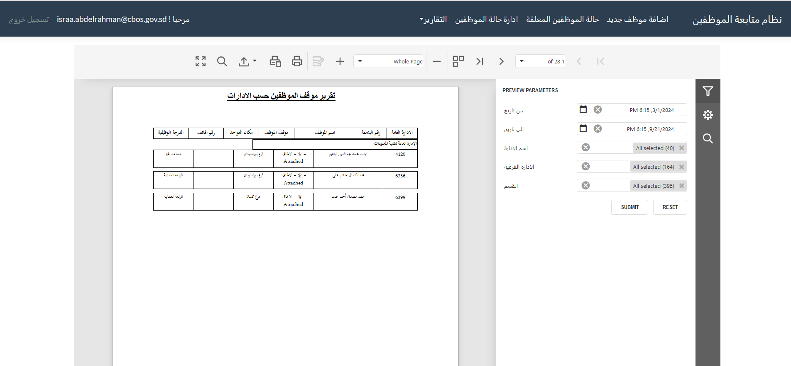

### 12- تقرير الموظفين حسب التصنيف
يحتوي هذا التقرير على تصنيف الموظف و الكادر و الدرجة الوظيفية و مكان التواجد

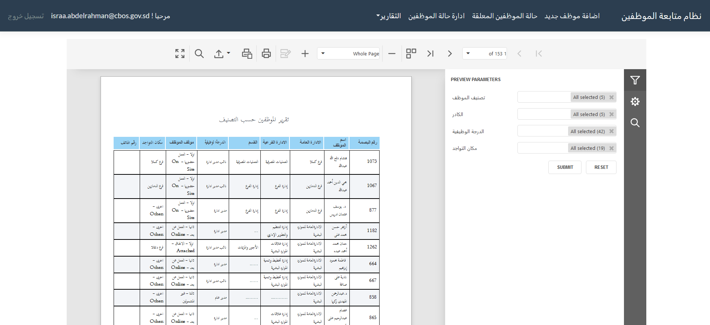

### 13- تقرير الموظفين المحذوفين
هذا التقرير يعتمد على اسباب حذف الموظفين

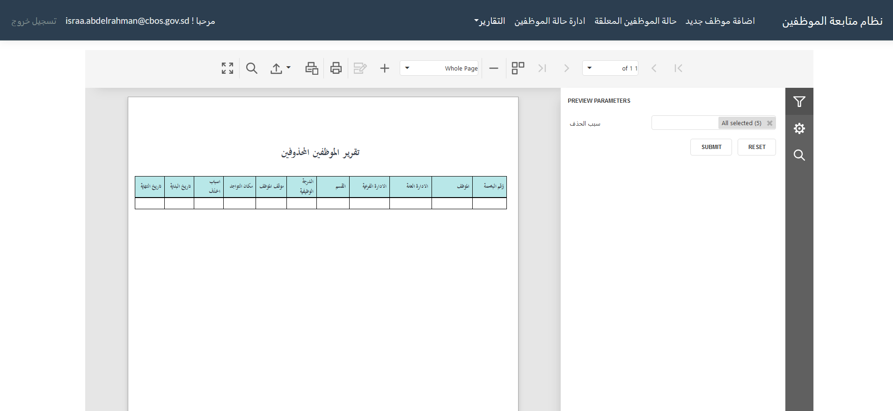

### 14- تقرير موقف الموظفين
هذا التقرير يقوم بعمل احصائيات لموقف الموظفين اعتمادا على الكادر 

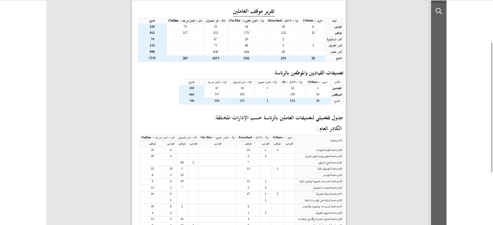